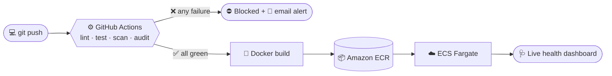

<div align="center">


<a href="https://github.com/tanahmeeedsx">
  
</a>

<br/>

<a href="https://www.linkedin.com/in/tanahmedd"></a>
<a href="mailto:tanjimahmed450@gmail.com"></a>
<a href="PORTFOLIO_URL"></a>
<a href="PORTFOLIO_URL/resume.pdf"></a>

<br/>


</div>

<br/>

> ### I take code from a commit to a **reachable, observable production URL** and automate everything that keeps it there.

<br/>

## 🧭 At a Glance

<div align="center">

|                        |                                                                                   |
| ---------------------- | --------------------------------------------------------------------------------- |
| 🏢 **Currently**       | DevOps Intern at **Springer Capital** · Remote (Chicago, USA)                     |
| 🧱 **Foundation**      | Git & GitHub workflows · Linux & Bash · Docker · CI/CD                            |
| 🎯 **Focus**           | **Automating reliability**: pipelines, health checks, logging and alerting        |
| ☁️ **Cloud**           | AWS: EC2 · ECS Fargate · ECR · VPC · IAM · Load Balancers · Security Groups        |
| 🌱 **Now Learning**    | Kubernetes · Terraform · HashiCorp Nomad · DevSecOps                              |
| 🧠 **Philosophy**      | Reliability isn't an accident. Automate it, observe it, then keep improving it.   |
| 🎯 **Open to**         | DevOps Engineer · Cloud Engineer · SRE · Platform Engineer                        |
| 📍 **Based in**        | Dhaka, Bangladesh · working with engineers across countries                       |

</div>

<br/>

## 📖 The Story So Far

Every project in this profile started the same way: something broke, and I wrote down why.

| Chapter | What happened |
| :--- | :--- |
| **01 · The Question** | Tutorials end at *"it works on my machine."* I wanted to know what comes after: how code becomes a live, reachable, **reliable** service. So I started with the craft: Git, pull requests, merge conflicts, SSH and Linux. |
| **02 · The First Pipeline** | **Mini Todo API.** A FastAPI app, a pull-request workflow and a GitHub Actions pipeline running tests, dependency checks and security checks. I debugged every failed run until it went green, then deployed to EC2 as a systemd service. The app was the practice. The pipeline was the point. |
| **03 · A Real Server** | I took a mentor's MERN incident-management app and got it running on **AWS EC2**, through SSH timeouts, a pending kernel upgrade, processes dying after disconnect and Git auth failures. I learned to debug one layer at a time with `nc`, `curl` and logs, instead of changing settings at random. |
| **04 · Containers to the Cloud** | **Cloud Health Monitor.** Dockerized, gated by GitHub Actions, shipped through **ECR** to **ECS Fargate**, with an email alert on every run. Then production pushed back, three times (see the [incident log](#-incident-log)). |
| **05 · The Team** | **Aug 2026:** DevOps Intern at **Springer Capital**, working remotely with engineers in different countries. Built an event-driven quiz pipeline with n8n, evaluated n8n in an isolated staging environment and audited Grafana Loki for high-cardinality labels (Jira DEV-290). |
| **06 · What's Next** | Making reliability automatic at a bigger scale: **Kubernetes**, **Terraform** and **DevSecOps**, earned through real projects instead of copied stacks. |

<details>
<summary><b>🗓️ Milestones</b></summary>

<br/>

| When | What |
| :--- | :--- |
| **Aug 2026 – Present** | DevOps Intern @ **Springer Capital** · Remote (Chicago, USA): Linux, Docker, CI/CD, AWS, Grafana Loki and n8n automation |
| **2026** | **DevOps and Cloud Engineering** certification track @ **bongoDev** |
| **Nov 2025 – Feb 2026** | Junior Executive @ SkyTech Solutions: client communication and lead handling |
| **Dec 2021 – Dec 2025** | B.Sc. in Computer Engineering @ **BUBT** |

</details>

<br/>

## 🔁 The Pipeline I Ship With



```bash
# production-mindset.sh
$ ship every change        # push → lint → test → build → deploy
$ keep it reliable         # systemd · safe rollouts · stable endpoints
$ keep it visible          # Loki logs · uptime checks · alerts
$ debug before guessing    # nc · curl · Security Groups · logs
```

<br/>

## 🚀 Featured Work

<table>
<tr>
<td width="50%" valign="top">

### 🩺 [Cloud Health Monitor](https://github.com/tanahmeeedsx/cloud-health-monitor)
**Docker → GitHub Actions → ECR → ECS Fargate**

A real-time dashboard for live CPU, memory and disk usage, plus a URL uptime checker. Every push runs ESLint, Prettier, Jest (with a coverage threshold), a security scan, `npm audit` and a Docker build. Any failure blocks the pipeline. Green builds roll out to Fargate by themselves.

`Node.js` `Express` `Docker` `GitHub Actions` `ECR` `ECS Fargate`

🔗 [Repository](https://github.com/tanahmeeedsx/cloud-health-monitor) · [Live dashboard](https://cl-f7cef06746784ff99fecdb01e3767f98.ecs.us-east-1.on.aws)

</td>
<td width="50%" valign="top">

### 🚨 [Incident Management & On-Call Tracker](https://github.com/tanahmeeedsx/incident-management)
**A MERN app on AWS EC2**

The app is my mentor's. The deployment, infrastructure and ops are mine: Ubuntu 24.04, Security Groups, SSH key pairs, EC2 Instance Connect and MongoDB under systemd. Along the way I debugged SSH timeouts, a pending kernel upgrade, dying processes and Git auth failures.

`AWS EC2` `Ubuntu` `systemd` `MongoDB` `Bash` `SSH`

🔗 [Repository](https://github.com/tanahmeeedsx/incident-management)

</td>
</tr>
<tr>
<td width="50%" valign="top">

### 🔁 [Mini Todo API: Git-to-Deployment CI/CD](https://github.com/tanahmeeedsx/mini-todo-api)
**Pull request → tests → security checks → EC2**

My first full Git-to-deployment workflow. A FastAPI app with a PR-based flow, GitHub Actions for tests, dependency checks and security checks, and secrets kept out of the repository. It deploys to EC2 as a systemd service, and the live API is verified through its endpoints.

`FastAPI` `GitHub Actions` `AWS EC2` `systemd` `Git`

🔗 [Repository](https://github.com/tanahmeeedsx/mini-todo-api)

</td>
<td width="50%" valign="top">

### 🔔 [Intern Pipeline Planning](https://github.com/tanahmeeedsx/intern-pipeline-planning)
**Baserow → Webhook → n8n → Mattermost**

An event-driven workflow built at Springer Capital. A quiz submission in Baserow triggers a webhook, n8n maps and transforms the fields, and a bot posts a structured result to Mattermost. It comes with a scoring script, answer-key notes and workflow screenshots.

`n8n` `Baserow` `Webhooks` `Mattermost` `REST APIs`

🔗 [Repository](https://github.com/tanahmeeedsx/intern-pipeline-planning)

</td>
</tr>
</table>

<details>
<summary><b>🧪 More from the lab</b></summary>

<br/>

- 🔧 [**DevOps Deployment Pipeline**](https://github.com/tanahmeeedsx/devops-deployment-pipeline): a full workflow with Linux, Git, Docker, CI/CD, HashiCorp Nomad and Grafana Loki for monitoring.
- ⚙️ [**GitHub Actions Testing**](https://github.com/tanahmeeedsx/github-actions-testing): automated testing pipelines for JavaScript projects.
- 🎮 [**Antigravity Tic-Tac-Toe**](https://github.com/tanahmeeedsx/antigravity-tic-tac-toe): a Node.js terminal game with an AI opponent, Jest tests and a full GitHub Actions CI pipeline.
- 🔀 [**Git & GitHub Workflow**](https://github.com/tanahmeeedsx/git-github-workflow): branching, merging, pull requests, conflict resolution and CI/CD exercises.
- 🔗 [**QR Code Generator**](https://github.com/tanahmeeedsx/qr-code-generator): a small QR code API built with Go.

</details>

<br/>

## 🧯 Incident Log

*A green pipeline means nothing until the app is reachable in production.* These are the three times I learned that the hard way, all from Cloud Health Monitor.

| 🔥 What broke | 🔎 Root cause | 🛠️ Fix | 💡 Lesson |
| :--- | :--- | :--- | :--- |
| **1,000+ CI errors** in one run | An AWS CLI folder was accidentally committed, so the style checks flagged files that were never part of my code | Removed it from Git and added it to `.gitignore` | Keep noise out of the pipeline, or real failures get buried |
| **App unreachable** after a green deploy | A Security Group rule was blocking public traffic | Opened the correct inbound port | Green CI is not the same as reachable. Verify the network path |
| **"Dead" app** after every restart | Fargate assigns a **new public IP** on each restart, so I was testing an IP that no longer existed | Switched to the **stable ECS service URL** | Never depend on an address that changes |

<br/>

## 🎯 Currently Sharpening

<table align="center">
<tr>
<td align="center" width="25%">🐳<br><b>Containerization</b><br><sub>Docker workflows</sub></td>
<td align="center" width="25%">📈<br><b>Observability</b><br><sub>Grafana Loki logging</sub></td>
<td align="center" width="25%">⚙️<br><b>Orchestration</b><br><sub>HashiCorp Nomad</sub></td>
<td align="center" width="25%">☁️<br><b>Cloud</b><br><sub>AWS EC2 deployments</sub></td>
</tr>
</table>

<br/>

## 🛠️ Tech Arsenal

<p align="center">
  
</p>

<p align="center"><sub>🌱 <b>Leveling up:</b></sub></p>

<p align="center">
  
</p>

<div align="center">

| | |
| :--- | :--- |
| ☁️ **Cloud & Containers** | AWS (EC2, ECS Fargate, ECR, VPC, IAM, Load Balancers, Security Groups) · Docker |
| 🔄 **CI/CD & Version Control** | GitHub Actions (lint, test, security and deploy gates, email alerts) · Git · GitHub · pull requests · SSH auth |
| 📈 **Observability** | Grafana Loki (stream and label-cardinality audits) · cron monitoring · uptime and health checks · Mattermost notifications |
| 🔐 **DevSecOps** | GitHub secrets · secret scanning · CodeQL · `npm audit` · `eslint-plugin-security` · SSH hardening (ED25519, key-only access) |
| 🤖 **Automation** | Ubuntu · systemd · Bash · n8n workflows · webhooks · REST APIs · Python (FastAPI) · Node.js · Go |

</div>

<br/>

## 🧩 Where I Fit

<table>
<tr>
<td width="25%" valign="top" align="center">

### ⚙️ DevOps Engineer
CI/CD pipelines with quality and security gates, Docker images and automated rollouts.

</td>
<td width="25%" valign="top" align="center">

### ☁️ Cloud Engineer
AWS deployments on EC2, ECS Fargate and ECR, with VPC, IAM and Security Group awareness.

</td>
<td width="25%" valign="top" align="center">

### 🩺 SRE
Health checks, logging, alerting and a written record of every failure and fix.

</td>
<td width="25%" valign="top" align="center">

### 🏗️ Platform Engineer
Automation workflows and repeatable pipelines: n8n, webhooks, REST APIs and scripts.

</td>
</tr>
</table>

<br/>

## 🌟 Open Source

<p align="center">
  <a href="https://github.com/bongodev/git-and-github">
    
  </a>
</p>

<p align="center"><sub>Contributing to <b>bongoDev/git-and-github</b>, a community learning resource for Git &amp; GitHub.</sub></p>

<br/>

## 🔥 Contribution Streak

<p align="center">
  
</p>

<br/>

## 🤝 Let's Build Something Reliable

I'm looking for **DevOps, Cloud, SRE and Platform Engineering** opportunities where I can ship, operate and improve production systems, and automate the parts that keep them up at 3 a.m.

<div align="center">

<a href="https://www.linkedin.com/in/tanahmedd"></a>
<a href="mailto:tanjimahmed450@gmail.com"></a>
<a href="PORTFOLIO_URL/resume.pdf"></a>

<br/><br/>

<sub>🛠️ <b>Build it. Ship it. Watch it. Improve it.</b></sub>


</div>
